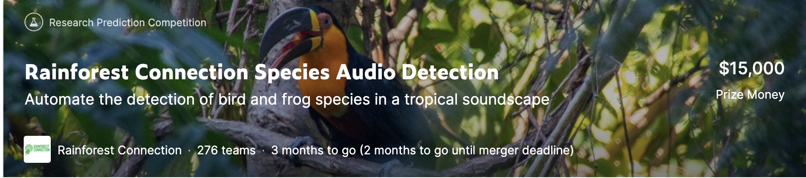
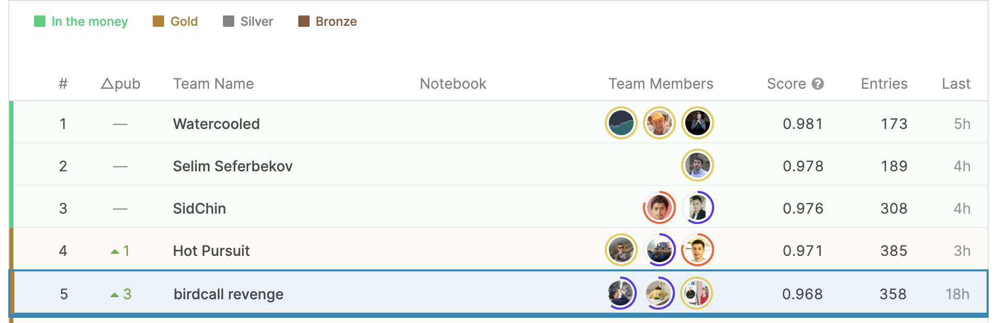
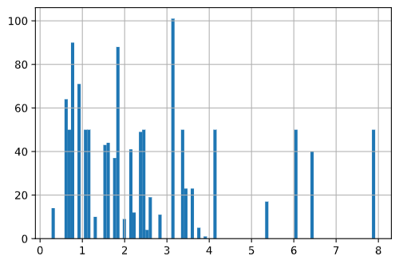
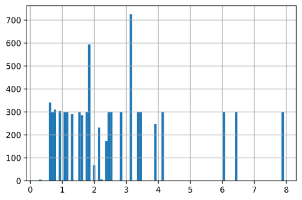
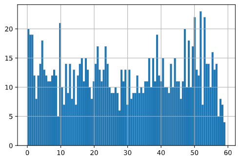
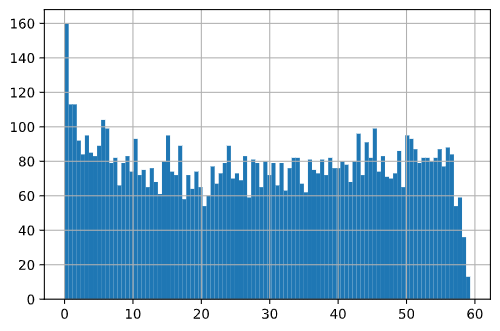
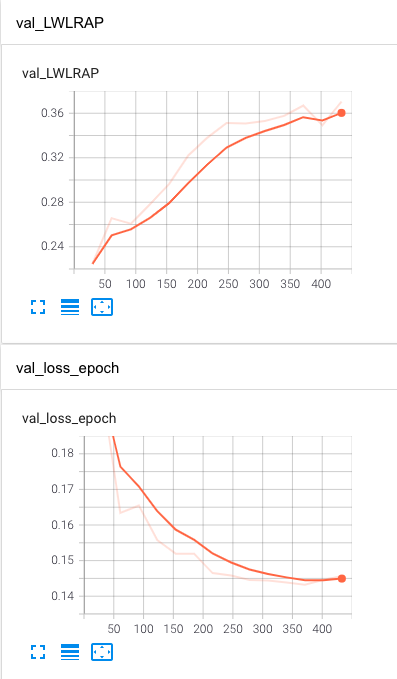
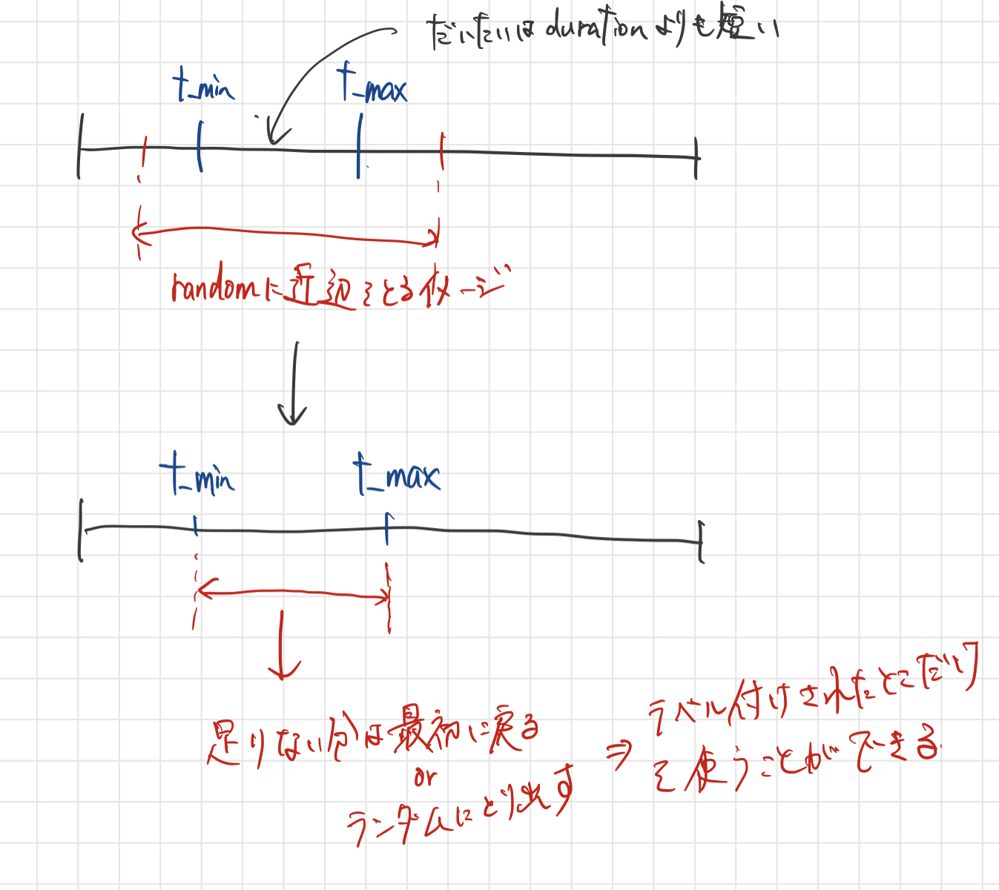

# kaggle-rainforest

https://www.kaggle.com/c/rfcx-species-audio-detection/overview 

## [2020/12/12]
コンペ取り組み開始  
アライさんのnotebookをひとまず読む
https://www.kaggle.com/hidehisaarai1213/rfcx-audio-data-augmentation-japanese-english　

### 音声向けのDA
| 手法 | 説明 |  特徴  |
| --- | --- | --- |
| GaussianNoise(white noise) |  正規分布に従うノイズ | ノイズの強さを指定して与えるので音声が小さい時ノイズで覆ってしまう |
| GaussianNoise(SNR) | SNRを考慮して適応的にノイズを与える | 元の音量はばらつきがあるので基本的にSNRを考慮したほうがいい |
| PinkNoise | 低周波数帯から徐々にノイズの強さを減少するようなノイズ | 自然界に存在するノイズはこれに近い  |
| PitchShift | 音のピッチ(高低)に関する調整 | 聞こえる音が高く/低くなる(スペクトログラムの場合パターンが上下する) 時間がかかる 音割れに注意 | 
| TimeStretch | 音を時間的に伸ばしたり縮めたりする | 時間がかかる | 
| TimeShift | 音を時間的にずらす  | ずらした余りの部分は削除するか前に持ってくるか |
| VolumeControl | 音量そのものを調整する | メルスペクトログラムに影響を与える(種類もいくつかある) |

SNR = SignalとNoiseの比   
ex)SNR > -1 -> Signalが大きい 

### データ形式
tfrecordsはどういう意義がある？
flac形式だけど変換はどうする？
birdcallではmp3 → wav(その際にサンプリング周波数も揃えていた)

wav:オリジナルデータ
mp3:非可逆圧縮形式
flac:可逆圧縮形式

flac

### データについて
trainのcsvは２種類存在する
|    |    |    |
| --- | --- | --- |
| train_fp.csv | false positive | ノイジーなラベルづけ？ |  7781 |
| train_tp.csv | true positive | expertがflagやidをラベリング？ | - | 

https://www.kaggle.com/c/rfcx-species-audio-detection/discussion/197866　
baselineとしてはtpデータのみでやってみる
訓練用のメタデータには時間ラベルも振ってあるが予測は音声ファイル単位で良い

#### fpデータはどのように使えそう？
tpで学習したモデルの予測値とfpのラベルが一致しているときは利用するとか？  

### [2020/12/16]
GitHub Actionsでkaggle datasetsに自分のコードを自動更新更新するようにした  
https://zenn.dev/hattan0523/articles/c55dfd51bb81e5 
とても便利  

Circle CIバージョンも試したい  
https://qiita.com/cfiken/items/a36b5742e9d26e0b4567  

hydraを使うとオブジェクトも全てconfigファイルで設定できるようにすることができる
lightningやmlflowなど色々導入しているので後からの方が良さそう

datasetsを
- train
- train_tp
- train_fp(データめっちゃ多い)
の３つに分けて作成した

trainは混ぜこぜ  
train_tpは綺麗なラベル  
train_fpはノイジーなラベル  

trainを使う場合はgroupkfoldでtpとfpのバランスが同じになるように学習をさせた方がいい？

train_fpの使い方がキモな気がする
self supervised learningが有効？

### [2020/12/17]
train_tp, train_fpの解釈が間違っていたので修正。

tpとfpの両方にあるaudioが存在している

### [2020/12/18]
tmax, tmin, fmax, fminを使ってlabel付けする

tmin, tmaxがラベルづけの時間方向の値
fmin, fmaxがラベルづけの周波数方向の値

resampleだけでなく時間軸方向をclipしたデータセットをあらかじめ作る？

label付けされている時間  
tp

fp

0.5~4sが多め

labelの最初の時間  
tp

fp

まちまちの一様分布
fpの方が最初の方にlabelが集まっている？  

ResNetでclipなしだとかなり低い
てかこんな低いもん？
→LB見るとそこらへんのスコアも見られるのでこんなもんかな

### clipのやり方

良いアイデアと思ったら既に実装あったので利用する
clipに関しては以下のdiscussionで3種類提案されている
アライさんが言及しているものを取り入れた方がセカンダリーラベルを扱えるので
一緒に生息している鳥とかを特定するのに良いかも?
https://www.kaggle.com/c/rfcx-species-audio-detection/discussion/200922#1102470

アライさんは10sのrandom crop
https://www.kaggle.com/c/rfcx-species-audio-detection/discussion/198132#1095233

### lossについて
以下のdiscussionをみるにcustom lossが重要そう

https://www.kaggle.com/c/rfcx-species-audio-detection/discussion/198132

### output_typeについて
nnの出力として
- logits
- multilabel_proba(sigmoid)
- multiclass_proba(softmax)
がある

今回のタスクでは
最終的なaudioに複数の鳥があると思うのでmultilabel_probaが良さげ？

pannsではclipwiseが使われている
output_dict = {
    "framewise_output": framewise_output,
    "segmentwise_output": segmentwise_output,
    "logit": logit,
    "framewise_logit": framewise_logit,
    "clipwise_output": clipwise_output
}

metricの都合上、予測値は大事ではなく順位が重要
1,0に離散化するのは無しかも

### SRについて
現在はbirdcallと同じようにSR＝32000で実験している
公開notebookは48000が多い
spectrogramsはSR/2までの周波数を捕捉する
f_maxは14000であることから問題はなさそう

### 予測の仕方について
アライさん
validation/testでは60sの音声を取り出したのちN(s)単位に分割し予測後各クリップの最大確率を取る
https://www.kaggle.com/c/rfcx-species-audio-detection/discussion/201920#1107868

fffrrt
accuracyを使っている？
https://www.kaggle.com/c/rfcx-species-audio-detection/discussion/201920#1104879

### [2020/12/19]
Disucussion top vote5本を読む

#### [train_tp vs. train_fp](https://www.kaggle.com/c/rfcx-species-audio-detection/discussion/197866)  
train_tp: 専門家によってtmin-tmax内(freqも)に該当の鳥種が含まれていることがチェック済み
train_fp: 専門家によってtmin-tmax内に該当の鳥種が含まれていないことがチェック済み

time labelのついていない箇所にも鳥が鳴いている可能性はある

fpのflagは相互相関アルゴリズムによって検出されたもの
tpとfpのflagには正の相関がある

訓練時はsegment labelで行うがtestはfile labelで行う

segment外では対象以外の鳥の鳴き声もある

#### [Best Single Model CV-LB](https://www.kaggle.com/c/rfcx-species-audio-detection/discussion/198132)  

lossとmodelのoutputをlogitsにしてresnestに変更すると
CV 0.5 → 0.7
になった
ただしtestのところが問題あり

testデータは全て1分(破損しているものもあるので要チェック)
